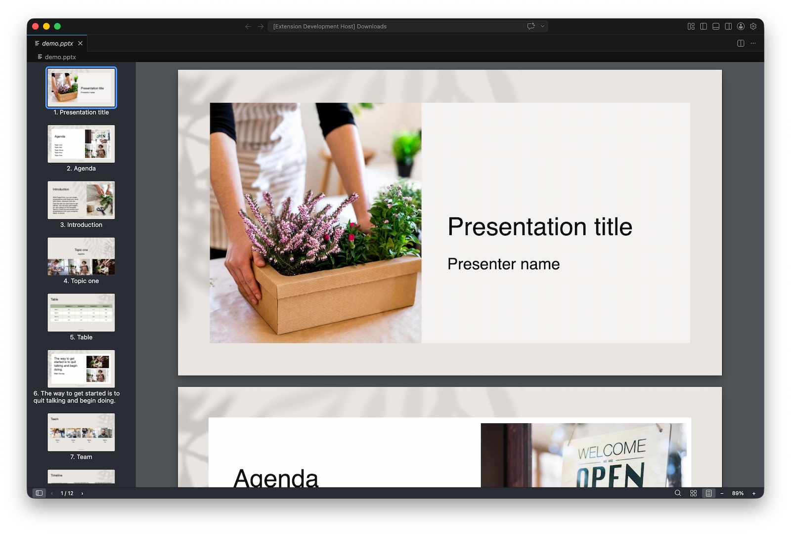
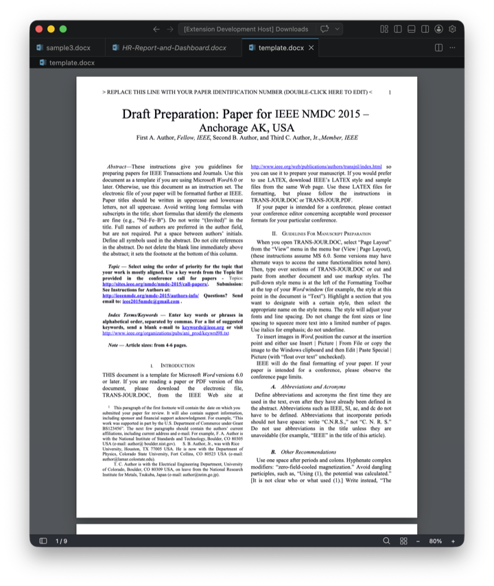
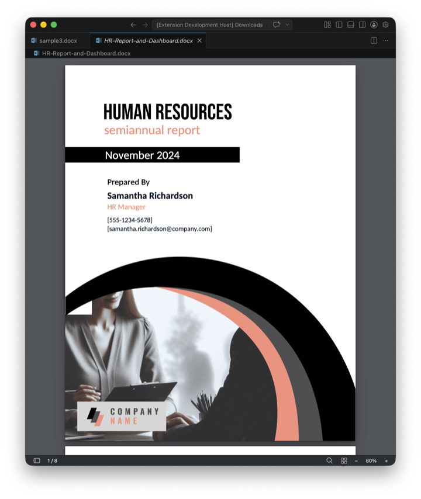
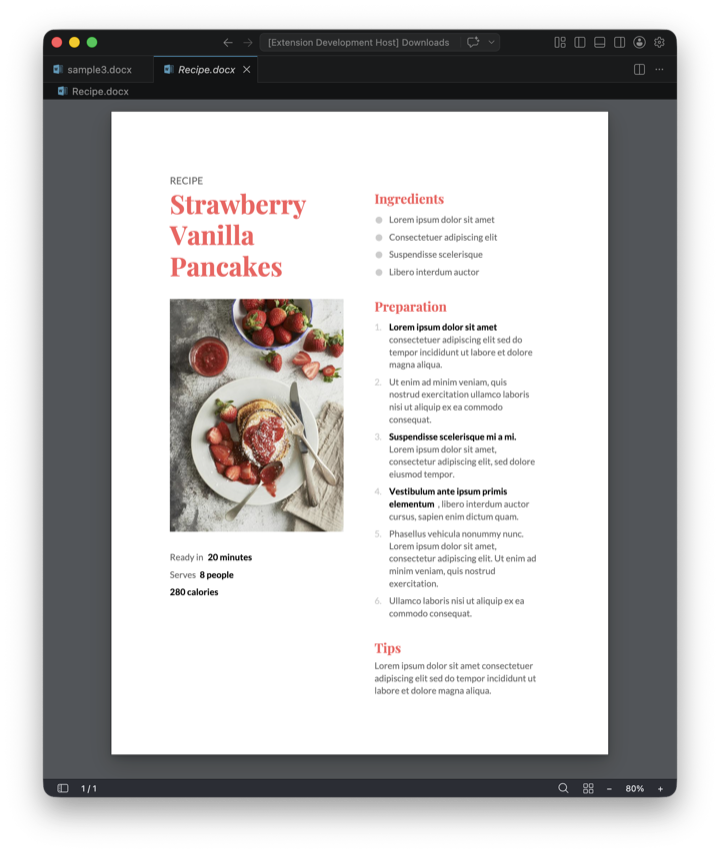
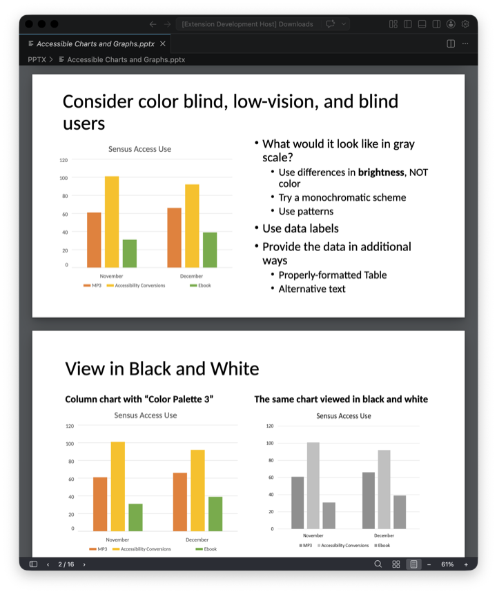
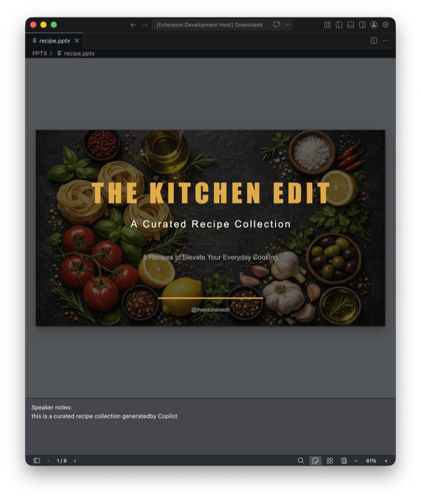
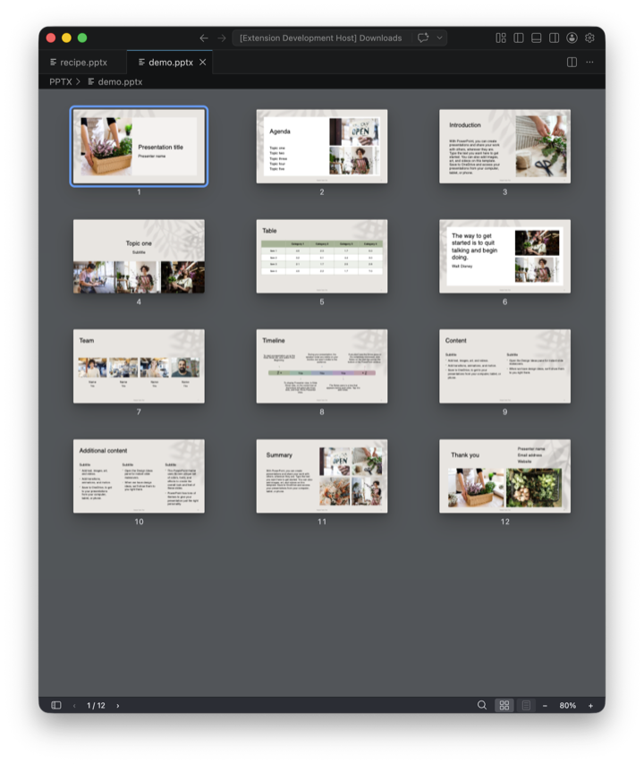
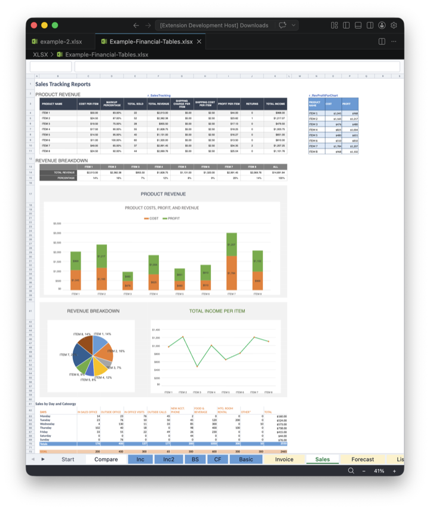
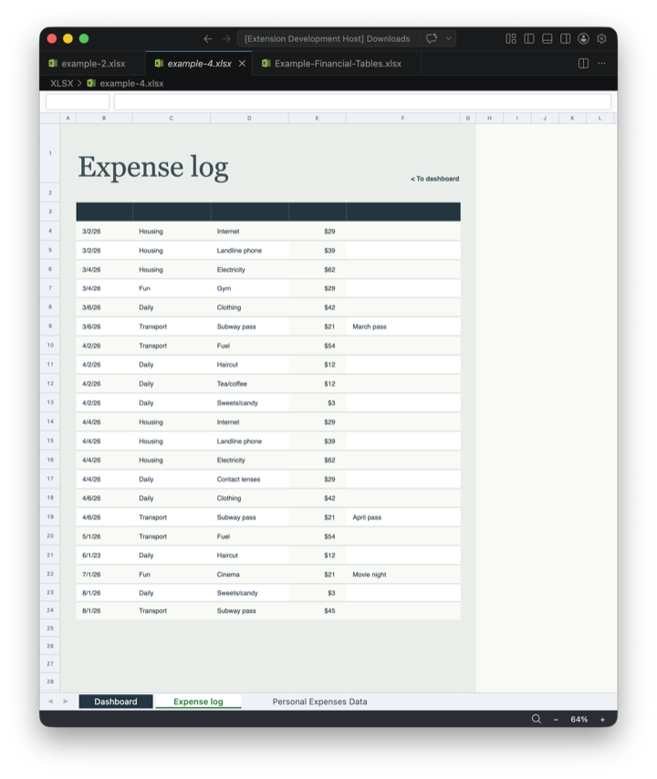
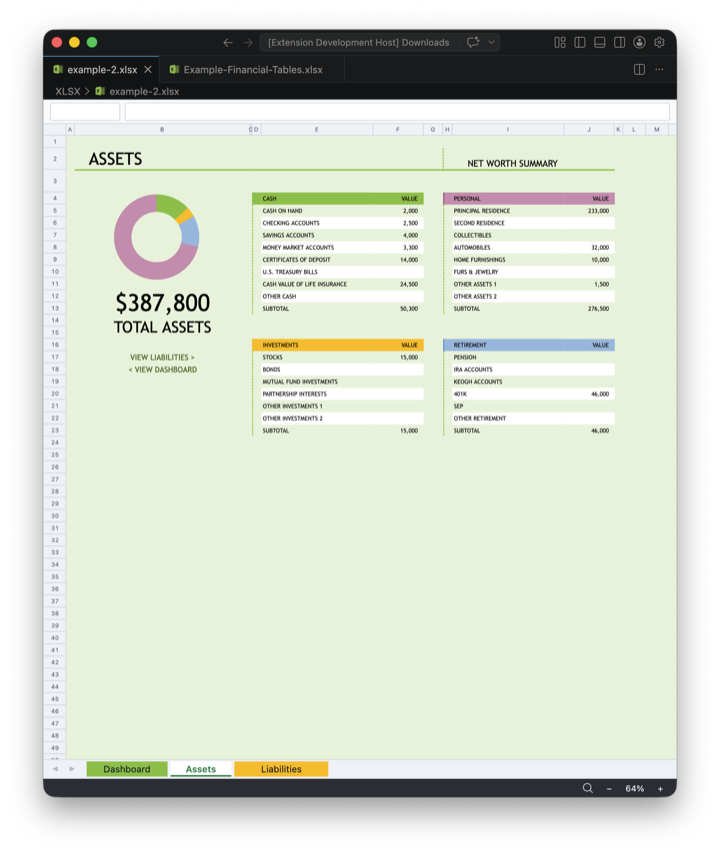

  

<h1 align="center">Office Viewer</h1>

  Office document viewer extension for VS Code with high-fidelity local rendering for <code>.docx</code>, <code>.xlsx</code>, and <code>.pptx</code> files. Modern, fast, fully local.

  

## Highlights

- **Fully offline and private.** Documents are rendered locally inside a sandboxed webview. Nothing is uploaded.
- **High-fidelity rendering.** Faithful reproduction of fonts, layouts, shapes, charts, and effects so documents look the way their authors intended.
- **Selectable text and clickable links.** Copy text out like on a web page, follow external hyperlinks, and jump between sheets in Excel.
- **Full-text search.** Case-sensitive and whole-word options across all pages. In Excel, search matches displayed values or underlying formulas, with cell addresses in results.
- **Multi-pane support.** Open the same file in split panes to compare different pages side by side.

## Supported formats

### Word

<table>
  <tr>
    <td width="33%"></td>
    <td width="33%"></td>
    <td width="33%"></td>
  </tr>
</table>

Headers and footers, comments, footnotes, endnotes, tracked changes, bookmarks, hyperlinks, table of contents, and math equations.

### PowerPoint

<table>
  <tr>
    <td width="33%"></td>
    <td width="33%"></td>
    <td width="33%"></td>
  </tr>
</table>

Shapes, SmartArt diagrams, charts, tables, and speaker notes. Continuous scroll or single-slide mode, plus a slide sorter grid view.

### Excel

<table>
  <tr>
    <td width="33%"></td>
    <td width="33%"></td>
    <td width="33%"></td>
  </tr>
</table>

Merged cells, frozen panes, conditional formatting (data bars, color scales, icon sets), sparklines, formulas, cell comments, and built-in table styles.

## Smooth navigation

  

- Toolbar with page navigation, jump-to-page, zoom in and out, and zoom presets (fit page, fit width, actual size, 50% to 400%).
- Sidebar with page thumbnails and a clickable heading outline.
- Keyboard and touch: arrow keys to flip pages, Ctrl/Cmd+F to search, swipe to navigate slides.

## Search anywhere

  

Find text across every page or sheet with case-sensitive and whole-word options. Excel search can match either the displayed value or the underlying formula, and results include the cell address.

## Rendering details

- Embedded fonts and CJK fallbacks for correct Chinese, Japanese, and Korean text on any platform.
- Visual effects like gradients, shadows, glow, dashed strokes, and patterned fills.
- Page-on-demand rendering keeps large documents responsive while you scroll and zoom.
